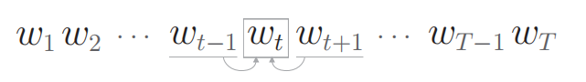
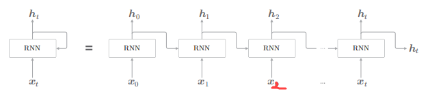
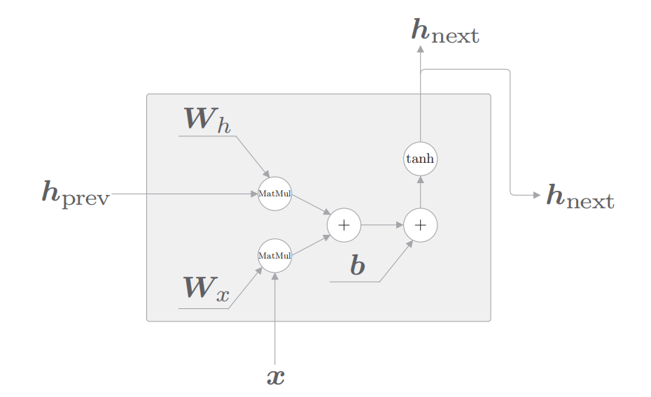
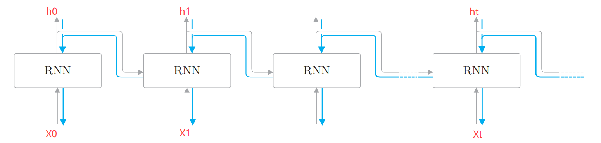
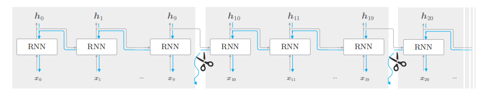
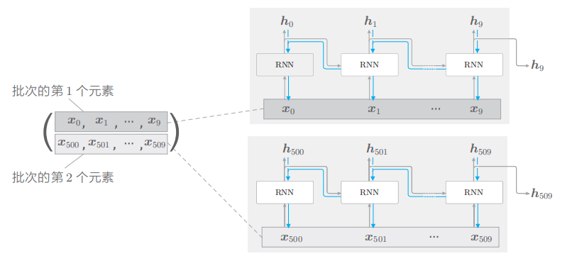
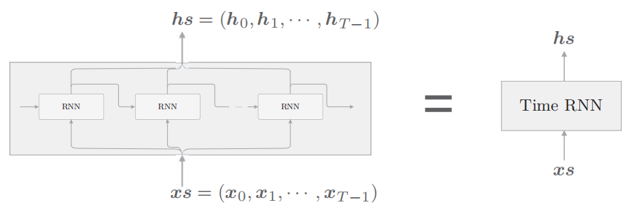
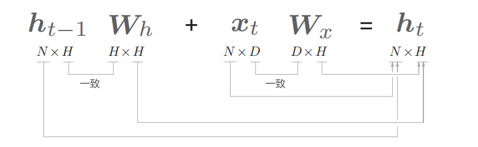
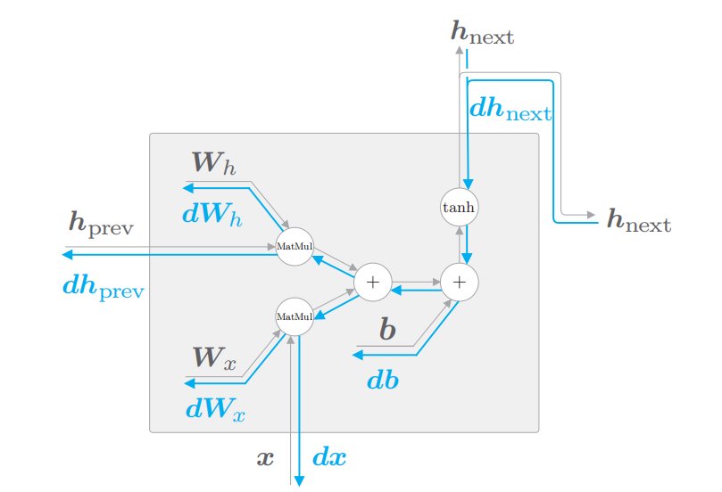

# 概率和语言模型

#### 概率

首先从概率视角来看一下word2vec的CBOW模型，假设我们现在有一个语料库$$w_1$$,$$w_2$$,...,$$w_T$$。如下图所示，CBOW 模型所做的事情就是从上下文（$$w_{t-1}$$和 $$w_{t+1}$$）预测目标词（$$w_t$$）。



上图可以用数学公式来表示为：
$$
P(w_t|w_{t-1},w_{t+1})
$$
*意思*是给定单词 $$w_{t-1}$$ 和 $$w_{t+1}$$ 时，单词$$w_{t}$$出现的<u>概率</u>是**多少**。

#### 语言模型

# RNN介绍

RNN（Recurrent Neural Network）被称为循环神经网络，RNN<u>*层*</u>结构图如下所示。



自然语言是一种时序数据，例如“我爱你”和“你爱我”这两句话表达的意思完全不同，对于“我爱你这句话”我们可以将“我”作为$$x_0$$，“爱”作为$$x_1$$，“你”作为$$x_2$$。首先看上图等式的左边，将$$x_t$$输入RNN，网络会产生一个输出，但是这个输出除了会作为$$h_t$$外，它还会作为自身的输入。再看上图等式的右边，将$$x_0$$输入RNN后，产生的输出除了会作为$$h_0$$外，还会作为下一层RNN的输入。这个$$h_0$$有什么作用后面会再说。

我们再看RNN内部的构造如下图所示。



上图用数学表达式可以表示为：
$$
h_{t}=tanh(h_{t-1}W_t+x_tW_x+b)
$$
注意：上图中的$$h_{prev}$$就是公式中的$$h_{t-1}$$，上图中的$$h_{next}$$就是上图公式中的$$h_t$$。

下图是RNN层的反向传播示意图。下面图是一个处理时序数据为T个的流程，我们将其称为RNN层。处理单个时序数据称为RNN。



上图的误差反向传播法是“按时间顺序展开的神经网络的误差反向传播法”，所以称为 Backpropagation Through Time（基于时间的反向传播），简称 BPTT。通过该 BPTT，RNN 的学习似乎可以进行了，但是在这之前还有一个必须解决的问题，那就是学习长时序数据的问题。因为随着时序数据的时间跨度的增大，BPTT 消耗的计算机资源也会成比例地增大。另外，反向传播的梯度也会变得不稳定。

在处理长时序数据时，通常的做法是将网络连接截成适当的长度。具体来说，就是将时间轴方向上过长的网络在合适的位置进行截断，从而创建多个小型网络，然后对截出来的小型网络执行误差反向传播法，这个方法称为 Truncated BPTT（截断的 BPTT）。

如下图所示，截断只是在反向传播时进行截断，而不会在正向传播时进行截断。为什么单独的一小段网络也能进行反向误差传播呢？因为每一小段都会有输出，从而可以通过损失函数计算误差，从而进行反向梯度传播。例如下图中的$h_9$，$h_{19}$，都可以通过损失函数计算误差，从而从这里进行反向梯度传播。



RNN的mini-batch。如下图所示，假设mini-batch的大小为2。输入是时序数据，那么第一批次的数据我们可以从$$x_0$$开始，第二批次的数据我们可以从$$x_{500}$$开始。这样我们就会把$$x_0$$和$$x_{500}$$数据作为一个矩阵输入到单个RNN中。注意这里数据$$x_t$$是一个向量，维度根据embedding维度而定，假如维度是5，那么数据$$x_t$$的格式就是$$[0.234,1.23,4,5,6]$$。



# RNN的实现

        //临时
        rtTask.Remove(rtTask.Attributes[TaskAttributes.EndLocation].Get<string>(), CsmEquipmentType.AGV, receiver);
        location.Manager.PartRuntimes[rtTask.CurrentPart].Remove();

为了使RNN层模块化，我们将下图模块模块化的称为TimeRNN。TimeRNN将输入统一称为$$x_s$$，将输出统称为$$h_s$$。



在RNN介绍一节中，我们已经介绍了RNN的mini-batch。如下图所示，mini-batch大小为N，单词embedding后的维度为D，输出向量维度为H，就有下图矩阵乘法维度表示关系。



下面我们写出单个RNN的正向传播和反向传播代码。首先看正向传播和反向传播示意图如下。



```python
class RNN:
     def __init__(self, Wx, Wh, b):
         self.params = [Wx, Wh, b]
         self.grads = [np.zeros_like(Wx), np.zeros_like(Wh),np.zeros_like(b)]
         self.cache = None
    
     def forward(self, x, h_prev):
         Wx, Wh, b = self.params
         t = np.dot(h_prev, Wh) + np.dot(x, Wx) + b
         h_next = np.tanh(t)
         self.cache = (x, h_prev, h_next)
         return h_next
    def backward(self, dh_next):
         Wx, Wh, b = self.params
         x, h_prev, h_next = self.cache
         dt = dh_next * (1 - h_next ** 2)
         db = np.sum(dt, axis=0)
         dWh = np.dot(h_prev.T, dt)
         dh_prev = np.dot(dt, Wh.T)
         dWx = np.dot(x.T, dt)
         dx = np.dot(dt, Wx.T)
         self.grads[0][...] = dWx
         self.grads[1][...] = dWh
         self.grads[2][...] = db
         return dx, dh_prev
```

正向传播代码很好理解，就照着公式计算就好了。反向传播的难点在矩阵乘法，矩阵乘法的反向传播算法参见博客神经网络的正向和反向传播。

