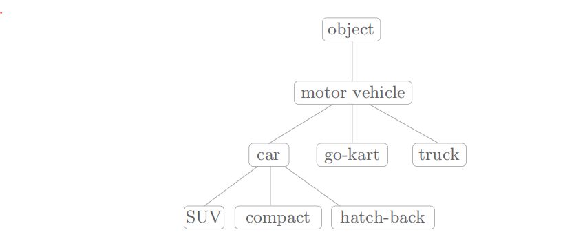
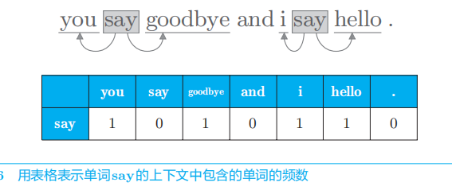
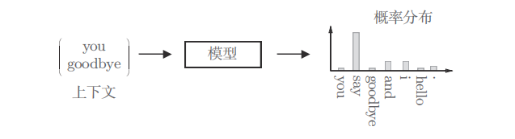

# 自然语言和单词的分布式表示

如果想让计算机处理自然语言(平常使用的语言，例如汉语、英语等)，那么我们第一步就是要让计算机能够理解自然语言。下面我们将简单介绍两种方法，一种是基于同义词词典的方法，一种是基于计数的方法。最后再仔细介绍word2vec方法。

#### 同义词词典

在同义词词典中，具有相同含义的单词（同义词）或含义类似的单词（近义词）被归类到同一个组中。比如，使用同义词词典，我们可以知道 car 的同义词有automobile、motorcar 等。另外，在自然语言处理中用到的同义词词典有时会定义单词之间的粒度更细的关系，比如“上位 - 下位”关系、“整体 - 部分”关系。举个例子，如下图所示，我们利用图结构定义了各个单词之间的关系。

像这样，通过对所有单词创建近义词集合，并用图表示各个单词的关系，可以定义单词之间的联系。利用这个“单词网络”，可以教会计算机单词之间的相关性。也就是说，我们可以将单词含义（间接地）教给计算机，然后利用这一知识，就能让计算机做一些对我们有用的事情。

使用同义词词典，即人工定义单词含义的方法存在很多问题。为了避免这些问题，接下来我们将介绍基于计数的方法和利用神经网络的基于推理的方法。这两种方法可以从海量的文本数据中自动提取单词含义，将我们从人工关联单词的辛苦劳动中解放出来。

#### 基于计数的方法

世界上存在各种各样的颜色，但是我们可以使用RGB三种颜色来表示另外任意一种颜色，这就是说我们在一个三维空间内使用三维向量就可以表示所有的颜色了。对于自然语言来说，我们也想使用一个向量来表示一个单词，至于这个单词是几维的我们现在还无法确定。这样，使用向量来表示单词的方式被称为==分布式表示==。

分布式表示到底是什么意思呢？我们要知道分布式假设。某个单词的含义由它周围的单词形成的想法被称为分布式假设。分布式假设所表达的理念非常简单。单词本身没有含义，单词含义由它所在的上下文（语境）形成。的确，含义相同的单词经常出现在相同的语境中。比如“I drink beer.”“We drink wine.”，drink 的附近常有饮料出现。另外，从“I guzzle beer.”“We guzzle wine.”可知，guzzle 和 drink 所在的语境相似。进而我们可以推测出，guzzle 和 drink 是近义词（顺便说一下，guzzle 是“大口喝”的意思）。

我们会经常使用“上下文”一词。上下文是指某个单词（关注词）周围的单词。上下文是指某个居中单词的周围词汇。这里，我们将上下文的大小（即周围的单词有多少个）称为窗口大小（window size）。窗口大小为 1，上下文包含左右各 1 个单词；窗口大小为 2，上下文包含左右各2 个单词，以此类推。

下面，我们来考虑如何基于分布式假设使用向量表示单词，最直截了当的实现方法是对周围单词的数量进行计数。具体来说，在关注某个单词的情况下，对它的周围出现了多少次什么单词进行计数，然后再汇总。这里，我们将这种做法称为“基于计数的方法”，在有的文献中也称为“基于统计的方法”。

如上图所示，我们有一句话为 you say goodbye and i say hello。这里单词you根据上下文就可以表示向量$[0,1,0,0,0,0,0]$，单词say根据上下文就可以表示为$[1,0,1,0,1,1,0]$，所以我们基于计数的方法就用向量表示出了单词。这里我们就浅尝辄止了，不继续往下介绍了。下面重点介绍word2vec方法。

# word2vec

上面介绍了基于计数的方法，这个方法会根据某个单词周边单词出现的次数来使用向量表示这个单词，但是这种方法会有很多缺点。word2vec是一种基于推理的方法，如下图所示，当给出周围的单词（上下文）时，预测“？”处会出现什么单词，这就是推理。

解开上图中的推理问题并学习规律，就是基于推理的方法的主要任务。通过反复求解这些推理问题，可以学习到单词的出现模式。从“模型视角”出发，这个推理问题如下图所示。

如上图所示，基于推理的方法引入了某种模型，我们将神经网络用于此模型。这个模型接收上下文信息作为输入，并输出（可能出现的）各个单词的出现概率。在这样的框架中，使用语料库来学习模型，使之能做出正确的预测。另外，作为模型学习的产物，我们得到了单词的分布式表示。这就是基于推理的方法的全貌。
