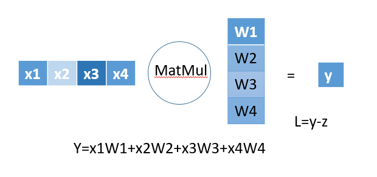

# 计算图

要正确理解误差反向传播算法，有两种方法，一种是数学式的方法，一种是通过计算图。虽然通过数学公式推导逻辑缜密，但是较难理解，通过计算图的方式，我们能够更直观的理解反向传播算法。在另一篇博客中我会讲解通过数学公式推导的反向传播算法。

# 矩阵乘法求导

不直接使用公式推导来说明矩阵乘法求导，因为那样非常抽象，让人无法理解。下面会一步一步从简单到复杂来分析矩阵乘法求导。首先我们要知道求导的一个核心思想是：要求导的那个变量值的轻微变动对最终结果影响的大小。

##### 矩阵乘法输出为标量

有下图维度的矩阵乘法y=xW。

假设D=4，则有下图形式，这里$x_1$只与$W_1$有关，$x_2$只与$W_2$有关，$x_3$只与$W_3$有关，$x_4$只与$W_4$有关，且都是普通乘法关系。首先我们要知道求导的一个核心思想是：要求导的那个变量值的轻微变动对最终结果影响的大小。所以根据普通乘法的求导规则，$y$对$x_1$的导数就是$W_1$，$y$对$W_1$的导数就是$x_1$，别的项同理。这样我们就得到了$y$对$x$的导数为$W^T$，$y$对$W$的导数为$x^T$。下图有损失函数对$y$的导数为$\frac{\delta L}{\delta y}=-1$，根据链式求导法则有L对$x$导数为：
$$
\frac{\delta L}{\delta x}=\frac{\delta L}{\delta y}\frac{\delta y}{\delta x}=-W^T
$$
其中：
$$
\frac{\delta L}{\delta x}=(\frac{\delta L}{\delta x_1},\frac{\delta L}{\delta x_2},\frac{\delta L}{\delta x_3},\frac{\delta L}{\delta x_4})
$$
有L对$W$导数为：
$$
\frac{\delta L}{\delta W}=\frac{\delta L}{\delta y}\frac{\delta y}{\delta x}=-x^T
$$

##### 矩阵乘法输出为向量

有下图维度的矩阵乘法y=xW。

假设上图中的D=4，H=2，15834548882。则有下图形式。$$x_1$$的变化与$$W_{11}$$和损失函数对$$y_{1}$$的导数有关，且$$x_{2}$$的变化与$$W_{12}$$和损失函数对$$y_{2}$$的导数有关。根据链式求导法则和下图中的计算公式可以算出:
$$
\frac{\delta L}{\delta x_1}=\frac{\delta L}{\delta y_1}W_{11}+\frac{\delta L}{\delta y_2}W_{12}=-W_{11}-W_{12}
$$
同理L对$$x_2$$,$$x_3$$,$$x_4$$都可以这样计算。

那么就有：
$$
\begin{aligned}
\frac{\delta L}{\delta x}
&=(\frac{\delta L}{\delta x_1},\frac{\delta L}{\delta x_2},\frac{\delta L}{\delta x_3},\frac{\delta L}{\delta x_4})\\ 
&=(\frac{\delta L}{\delta y_1}W_{11}+\frac{\delta L}{\delta y_2}W_{12},\frac{\delta L}{\delta y_1}W_{21}+\frac{\delta L}{\delta y_2}W_{22},\frac{\delta L}{\delta y_1}W_{31}+\frac{\delta L}{\delta y_2}W_{32},\frac{\delta L}{\delta y_1}W_{41}+\frac{\delta L}{\delta y_2}W_{42})\\
&=(\frac{\delta L}{\delta y_1},\frac{\delta L}{\delta y_2})
\begin{bmatrix}
W_{11} & W_{21} & W_{31} & W_{41} \\ W_{12} & W_{22}& W_{32}& W_{42}
\end{bmatrix}\\
&=\frac{\delta L}{\delta y}W^T
\end{aligned}
$$
从下图可以看出$$W_{11}$$的变化只与$$x_1$$有关，$$W_{12}$$的变化也只与$$x_1$$有关。那么就有$$\frac{\delta L}{\delta W_{11}}=\frac{\delta L}{\delta y_1}x_1$$，$$\frac{\delta L}{\delta W_{12}}=\frac{\delta L}{\delta y_2}x_1$$，别的项都可以按照此想法计算，最后有：
$$
\begin{aligned}
\frac{\delta L}{\delta W}
&=\begin{bmatrix}
\frac{\delta L}{\delta y_1}x_1&\frac{\delta L}{\delta y_2}x_1\\
\frac{\delta L}{\delta y_1}x_2&\frac{\delta L}{\delta y_2}x_2\\
\frac{\delta L}{\delta y_1}x_3&\frac{\delta L}{\delta y_2}x_3\\
\frac{\delta L}{\delta y_1}x_4&\frac{\delta L}{\delta y_2}x_4\\
\end{bmatrix}\\
&=x^T\frac{\delta L}{\delta y}
\end{aligned}
$$

##### 矩阵乘法输出为矩阵

这个就是按照上面输出为向量一样的过程进行理解就行了，我把图画出来了，就不进行推到了，最后的公式和上面是完全一样的。

